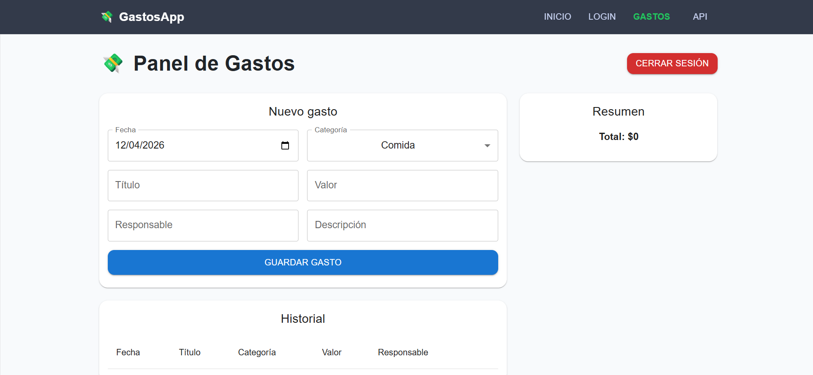

💰 Sistema de Gestión de Gastos Diarios (React + Vite + PWA)
📌 Descripción general

Esta aplicación web está diseñada para gestionar gastos personales de forma eficiente, permitiendo a los usuarios registrar, visualizar y administrar sus consumos diarios.

Incluye un sistema completo de autenticación de usuarios, asegurando que cada persona acceda únicamente a su información. La persistencia de datos se maneja con MongoDB, mientras que la comunicación entre cliente y servidor se realiza mediante Axios.

Entre sus principales capacidades se destacan:

Registro de gastos con fecha y responsable
Eliminación de registros
Visualización de resúmenes por usuario
Protección de rutas privadas
Interfaz adaptable (responsive)
🚀 Stack tecnológico
🖥️ Cliente (Frontend)
React
Vite
Material UI (MUI)
React Router DOM
Axios
Recharts
vite-plugin-pwa
⚙️ Servidor (Backend)
Node.js
Express
MongoDB
Mongoose
JSON Web Token (JWT)
bcryptjs

---

## 🧱 Arquitectura del proyecto

El proyecto sigue una estructura **Feature-Based**, lo que permite mayor escalabilidad y mantenimiento.

```
gastos/
│
├── backend/
│   ├── config/
│   │   └── db.js
│   │
│   ├── controllers/
│   │   ├── authController.js
│   │   └── expenseController.js
│   │
│   ├── middleware/
│   │   └── auth.js
│   │
│   ├── models/
│   │   ├── User.js
│   │   └── Expense.js
│   │
│   ├── routes/
│   │   ├── authRoutes.js
│   │   └── expenseRoutes.js
│   │
│   ├── .env 
│   ├── .gitignore
│   ├── package.json
│   └── index.js
│
├── frontend/  
│   ├── public/
│   │   ├── icon.png
│   │   └── manifest.json (auto generado)
│   │
│   ├── src/
│   │   ├── api/
│   │   │   ├── index.js
|   |   |   ├──components/
|   |   |        ├──ApiRyC
│   │   │   
│   │   │   
│   │   │
│   │   ├── features/
│   │   │   ├── auth/
│   │   │   │   ├── components/
│   │   │   │   │   └── Login.jsx
│   │   │   │   └── hooks/
│   │   │   │       └── useAuthForm.js
│   │   │   │
│   │   │   ├── expenses/
│   │   │   │   └── pages/
│   │   │   │       └── Expenses.jsx
│   │   │   │
│   │   │   └── layout/
│   │   │       ├── components/
│   │   │       │   ├── Header.jsx
│   │   │       │   ├── Footer.jsx
│   │   │       │   └── Content.jsx
│   │   │       └── pages/
│   │   |         └── Expenses.jsx
│   │   ├── services/      
|   |   |          ├── auth.service.js
│   │   │          └── expenses.service.js    
│   │   ├── App.jsx
│   │   └── main.jsx
│   │--index.html
│   ├── .env
│   ├── package.json
│   └── vite.config.js
│
|
|
|
|
└── README.md

Vistas de la aplicación
🔐 Pantalla de acceso

💸 Panel principal

📱 Vista móvil


⚙️ Instalación
1️⃣ Clonar el repositorio
git clone https://github.com/tu-usuario/tu-repo.git
2️⃣ Ejecutar el frontend
cd frontend
npm install
npm run dev
3️⃣ Ejecutar el backend
cd backend
npm install
node index.js
🔐 Variables de entorno

Crear un archivo .env dentro del backend con la siguiente configuración:

MONGO_URI=tu_uri_de_mongodb
JWT_SECRET=clave_secreta
PORT=3000
🔗 Comunicación entre cliente y servidor

Las solicitudes HTTP se realizan con Axios, incluyendo el token de autenticación en cada petición:

Authorization: Bearer <token>
📱 Aplicación PWA

La app está configurada como Progressive Web App, lo que permite:

Instalación en dispositivos móviles
Uso con conexión limitada
Uso de Service Worker
Definición de manifest
📊 Funcionalidades clave

✔ Registro e inicio de sesión
✔ Control de acceso a rutas protegidas
✔ Creación y eliminación de gastos
✔ Visualización de datos por usuario
✔ Cierre de sesión

🌐 Opciones de despliegue

Puedes publicar la aplicación en:

Frontend: Vercel
Backend: Render o Railway
📈 Mejores prácticas implementadas
Arquitectura modular
Separación de responsabilidades
Validaciones en cliente y servidor
Código reutilizable
Base lista para optimización futura
👨‍💻 Autor

Desarrollado por: Jordy Ramírez

📌 Estado actual

🟢 Aplicación funcional
🟢 Estructura escalable
🟡 Mejorable con nuevas características